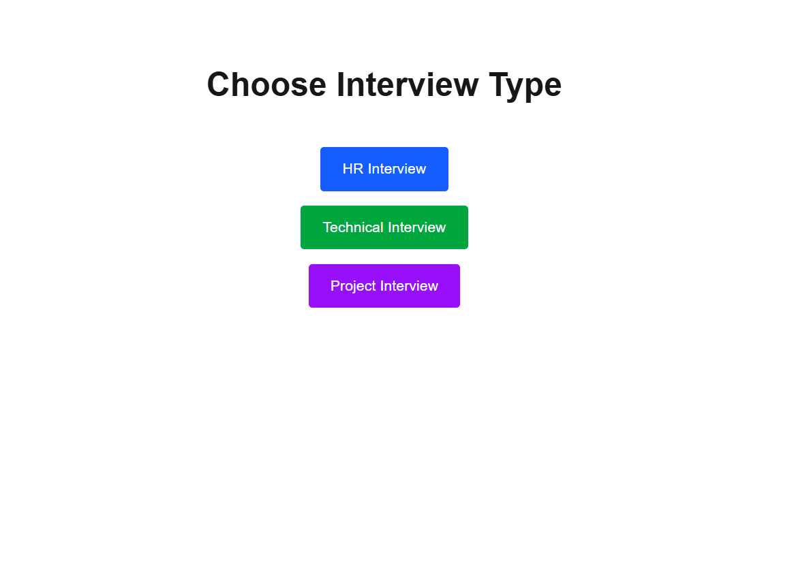
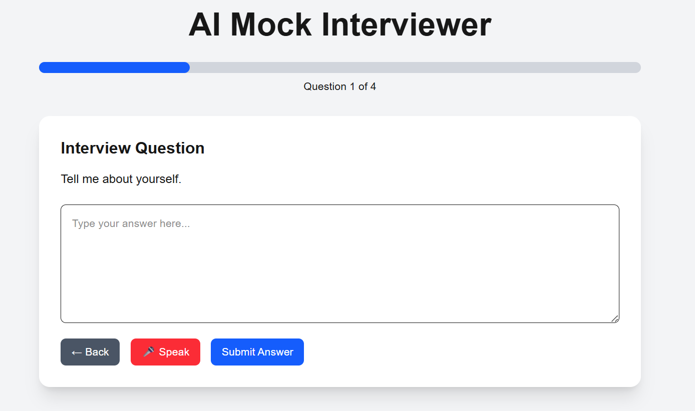
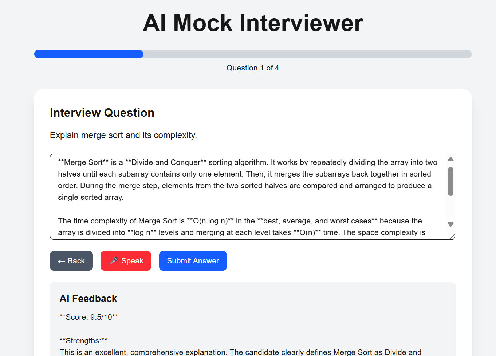
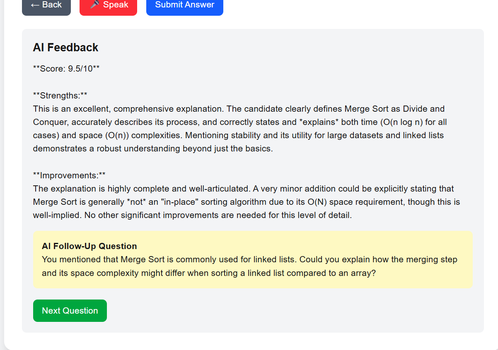
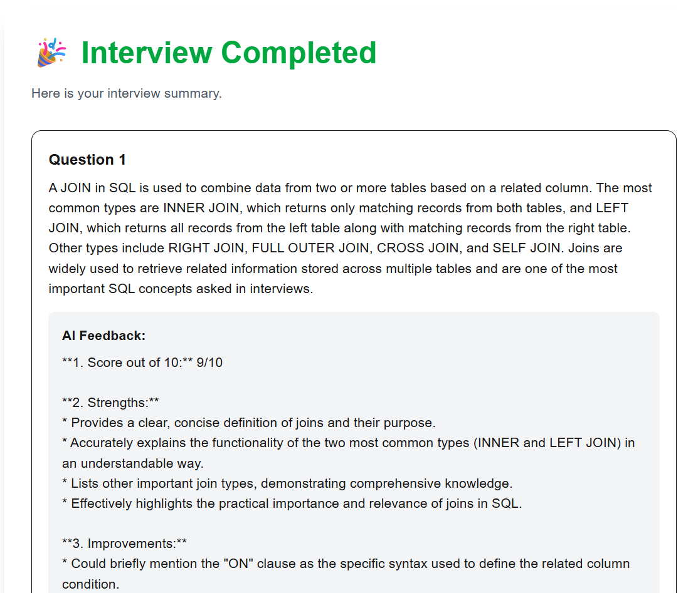
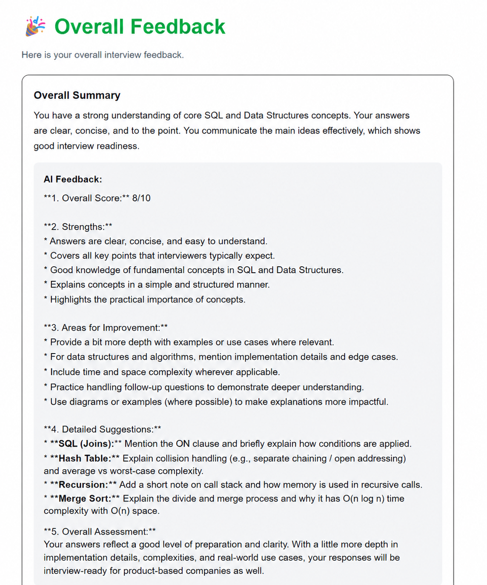

# 🎤 AI Mock Interviewer

> Practice interviews, receive instant AI feedback, and improve your interview performance with Generative AI.


---

## 📌 Overview

Preparing for interviews can be challenging because candidates often lack personalized feedback and realistic interview practice.

**AI Mock Interviewer** is a Generative AI-powered platform that simulates interview rounds and evaluates candidate responses in real time. The system provides detailed feedback, identifies strengths and weaknesses, and generates an overall interview assessment.

The goal of this project is to help students and job seekers improve their interview performance before facing real recruiters.

---

## ✨ Key Features

### 🎯 Interview Categories

Users can choose from multiple interview types:

* HR Interview
* Technical Interview
* Project-Based Interview

---

### 🤖 AI-Powered Evaluation

Every answer is evaluated using Gemini AI.

The system generates:

* Score out of 10
* Strengths
* Areas for Improvement
* Communication Assessment

---

### 📊 Final Interview Report

At the end of the interview, the candidate receives:

* Overall Performance Score
* Communication Skills Rating
* Technical Knowledge Rating
* Confidence Level Assessment
* Strengths Summary
* Improvement Suggestions
* Hiring Recommendation

---

### 🎙️ Voice Input Support

Users can answer questions using:

* Keyboard Input
* Speech Recognition

This creates a more realistic interview experience.

---

### 📈 Interview Progress Tracking

The application includes:

* Progress Bar
* Question Counter
* Interview Completion Status

---

### 🔄 Dynamic Technical Questions

Technical interviews randomly select questions from a larger question bank, ensuring a different experience in every session.

---

## 🏗️ System Architecture

```text
User
  │
  ▼
Next.js Frontend
  │
  ▼
FastAPI Backend
  │
  ▼
Gemini AI
  │
  ▼
Feedback & Evaluation
```

---

## 📸 Application Screenshots


### Interview Category Selection



---

### Interview Question Screen




---

### AI Feedback Generation



---

### Final Evaluation Report




---

## 🛠️ Tech Stack

### Frontend

| Technology   | Purpose               |
| ------------ | --------------------- |
| Next.js      | UI Framework          |
| React        | Component Development |
| TypeScript   | Type Safety           |
| Tailwind CSS | Styling               |

### Backend

| Technology | Purpose       |
| ---------- | ------------- |
| FastAPI    | REST API      |
| Python     | Backend Logic |

### AI

| Technology        | Purpose              |
| ----------------- | -------------------- |
| Google Gemini API | Interview Evaluation |

---

## 📂 Project Structure

```text
AI-Mock-Interviewer
│
├── backend
│   ├── main.py
│   ├── requirements.txt
│   └── .env
│
├── frontend
│   ├── app
│   ├── public
│   ├── package.json
│   └── next.config.ts
│
├── screenshots
│
└── README.md
```

---

## ⚙️ Installation

### Clone Repository

```bash
git clone https://github.com/Harshika-Jaiswal/AI-Mock-Interviewer.git

cd AI-Mock-Interviewer
```

---

### Backend Setup

```bash
cd backend

python -m venv venv

venv\Scripts\activate

pip install -r requirements.txt

uvicorn main:app --reload
```

Backend:

```text
http://127.0.0.1:8000
```

---

### Frontend Setup

```bash
cd frontend

npm install

npm run dev
```

Frontend:

```text
http://localhost:3000
```

---

## 🔑 Environment Variables

Create a `.env` file inside the backend directory:

```env
GEMINI_API_KEY=YOUR_API_KEY
```

---

## 🧠 Generative AI Usage

The application uses Gemini AI to:

* Evaluate interview answers
* Generate personalized feedback
* Analyze interview performance
* Produce final hiring recommendations

This project demonstrates practical integration of Generative AI into a real-world application.

---

## 🚀 Future Improvements

* Resume-Based Interviews
* AI Follow-Up Questions
* Authentication & User Accounts
* Interview History
* Analytics Dashboard
* Company-Specific Question Sets
* Cloud Deployment
* PDF Report Generation

---

## 💡 Learning Outcomes

Through this project I gained experience with:

* Full Stack Development
* REST API Design
* FastAPI Backend Development
* Next.js Frontend Development
* Generative AI Integration
* State Management
* Speech Recognition APIs
* Git & GitHub Workflow

---

## 👨‍💻 Author

**Harshika Jaiswal**

